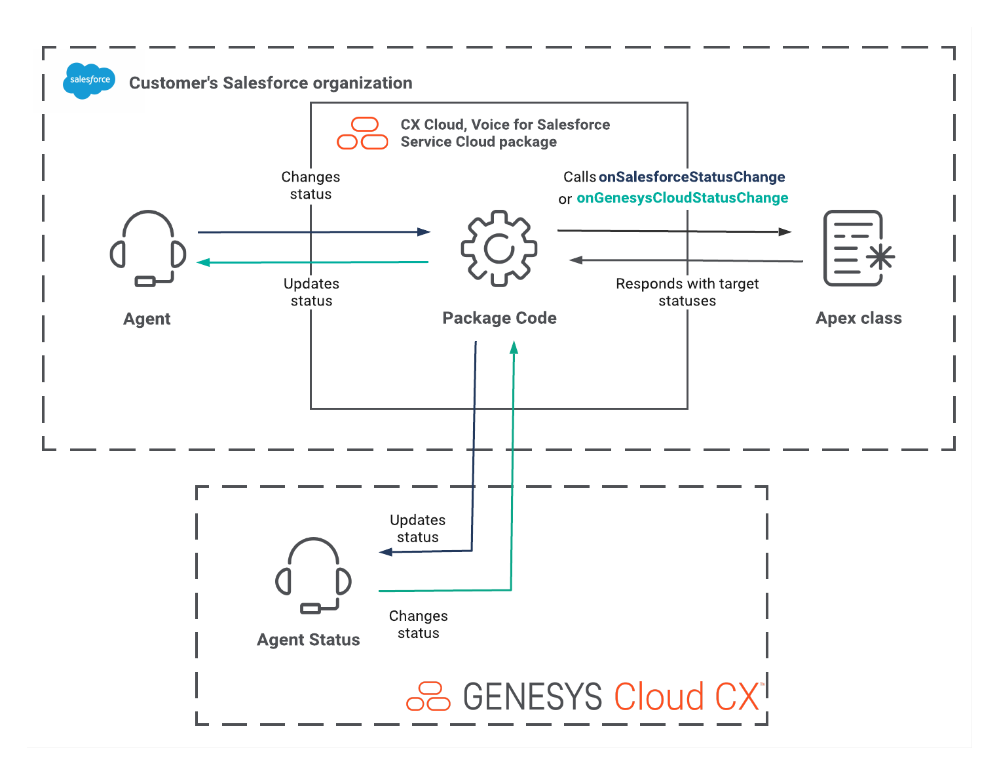

This Genesys Cloud Developer Blueprint demonstrates how to use the enhanced status sync option in CX Cloud from Genesys and Salesforce integration. This blueprint shows the comprehensive status mapping between Genesys Cloud and Salesforce Omni-Channel.

This blueprint provides an example of the Salesforce Apex class that demonstrates how to handle the status change events and how to respond to them. Both Salesforce status changes and Genesys Cloud status changes trigger events. To use the solution given in this blueprint, replace the Ids in the [class](https://github.com/GenesysCloudBlueprints/enhanced-status-syncing-with-salesforce-service-cloud-voice/blob/main/blueprint/src/classes/StatusSyncManager.cls "Opens the StatusSyncManager.cls") with the Ids from your Genesys Cloud and Salesforce organizations.



## Scenario

Customers who use Workforce Engagement Management require a more detailed status integration.

## Solution

This blueprint explains:
* how to extend the `GenesysSCVExtension.Status` class of the CX Cloud, Voice for Salesforce Service Cloud package in CX Cloud from Genesys and Salesforce integration. 
* how to set up your Apex class to receive status change events from both Genesys Cloud and Salesforce. 
* the format of the incoming and outgoing data and demonstrates how you can customize your status mapping.

### Input

```
{
	"salesforceStatus": {
		"currentStatus": {
			"statusApiName": "Online",
			"statusId": "0NXXX000000XXXu",
			"statusName": "Online"
		},
		"targetStatus": {
			"statusApiName": "AvailableforVoice",
			"statusId": "0NXXXX000000XXV",
			"statusName": "Available for Voice"
		}
	},
	"genesysCloudStatus": {
		"currentStatus": {
			"id": "6a3aXXXX-942f-XXXd-9700-5f9bXXXXae9b",
			"systemPresence": "Available"
		},
		"targetStatus": {
			"id": "6a3aXXXX-942f-XXXd-9700-5f9bXXXXae9b",
			"systemPresence": "Available"
		}
	}
}
```

### Output

```
{
	"salesforceStatus": {
		"targetStatus": {
			"statusId": "0NXXX000000XXXu"
		}
	},
	"genesysCloudStatus": {
		"targetStatus": {
			"id": "e08eXXXb-ee47-XXX9-a231-1200XXXX798f"
		}
	}
}
```

## Solution components

* **Genesys Cloud** - A suite of Genesys cloud services for enterprise-grade communications, collaboration, and contact center management. You create and manage statuses in Genesys Cloud.
* **Salesforce** - The Salesforce cloud customer relationship management (CRM) platform. 
* **CX Cloud from Genesys and Salesforce** - The Genesys Cloud integration that embeds Genesys Cloud in Salesforce Service Cloud.
* **CX Cloud, Voice for Salesforce Service Cloud managed package** - The managed package that contains all the installation components necessary to run CX Cloud, Voice for Salesforce Service Cloud.
* **Genesys Cloud API** - A set of RESTful APIs that enables you to extend and customize your Genesys Cloud environment. This solution uses the API to get the status Ids.

## Prerequisites

### Specialized knowledge

* Administrator-level knowledge of Genesys Cloud
* Administrator-level knowledge of Salesforce and programming experience with Apex code

### Genesys Cloud account

* A Genesys Cloud license. For more information, see [Genesys Cloud pricing](https://www.genesys.com/pricing "Opens the Genesys Cloud pricing page") on the Genesys website.

### Permissions

The administrator must have the following permissions:
  *  **Integration** > **cxCloudSFVoice** > **Add**
  *  **Integration** > **cxCloudSFVoice** > **Edit**
  *  **Integration** > **cxCloudSFVoice** > **View**

For more information, see [Requirements for CX Cloud from Genesys and Salesforce](https://help.mypurecloud.com/?p=166994 "Opens the Requirements for CX Cloud from Genesys and Salesforce article") in the Genesys Cloud Resource Center.

### Salesforce account

* A Salesforce organization with the packages installed and configured for CX Cloud from Genesys and Salesforce integration. For more information, see [Install the CX Cloud, Voice for Salesforce Service Cloud package](https://help.mypurecloud.com/?p=39356/ "Opens the Install the CX Cloud, Voice for Salesforce Service Cloud package article") in the Genesys Cloud Resource Center.
* The Salesforce organization and the CX Cloud from Genesys and Salesforce integration configured for Enhanced Status Sync. For more information, see [Configure Genesys admin settings](https://help.mypurecloud.com/?p=280463 "Opens the Configure Genesys admin Settings") in the Genesys Cloud Resource Center.
* User assigned with a System Administrator profile in Salesforce. For more information, see [Standard Profiles](https://help.salesforce.com/articleView?id=standard_profiles.htm&type=5 "Opens Standard Profiles") in the Salesforce documentation.

## Implementation steps

### Create a new Apex class in Salesforce

To create the `StatusSyncManager` class in Salesforce:
1. In the Salesforce Developer Console, select **File** > **New** > **Apex Class**.
2. Enter **StatusSyncManager** and then click **OK**.
3. Replace the default code with the code at `src/classes/StatusSyncManager.cls`.
4. Save the file to Salesforce. 

### Update Genesys Cloud status Ids

Get the status Ids from your Genesys Cloud organization:
1. To get the status Ids from your Genesys Cloud org, make an API call to `https://api.{region}.com/api/v2/systempresences`. For more information, see [API Explorer](https://developer.genesys.cloud/devapps/api-explorer "Opens the API Explorer") in the Genesys Cloud Developer Center.
2. In the **StatusSyncManager** class, for each newly instantiated **GenesysTargetStatus** class, replace the `CHANGE ME` text with the corresponding valid Id retrieved from the Genesys Cloud org.
3. Save the **StatusSyncManager** class in Salesforce.

### Update Salesforce status Ids

Get the status Ids from your Salesforce organization:
1. In the Salesforce Developer Console Query Editor panel, enter the following query:

	`SELECT DeveloperName, Id, MasterLabel FROM ServicePresenceStatus WHERE IsDeleted = false`
2.  Click **Execute**.
   
	The query result displays in the Query Results grid in the Developer Console workspace. 
3.  In the **StatusSyncManager** class, for each newly instantiated **SalesforceTargetStatus** class, replace the `CHANGE ME` text with the corresponding valid Id that you got from the query result.
4. Save the **StatusSyncManager** class in Salesforce.

### Configure Service Cloud Voice settings

Access the Lightning app configured for managing the contact center settings. See [Configure Genesys Admin Settings](https://help.mypurecloud.com/?p=280463 "Opens the Configure Genesys Admin Setting article") in the Genesys Cloud Resource Center

1. Launch the Lightning app configured with the GC for SCV Settings component for contact center management. 
2. Select the Genesys admin settings from the app navigation items.
3. Select the desired contact center.
4. Under the **Status Management** section, search and select the extension Class **StatusSyncManager** for **Enhanced Status Syncing**.
5. Click **Save** and refresh the page for the new settings to take effect.

### Test your solution

1. Log in to Salesforce and launch the Lightning app for contact center.
2. Log in to the Omni-Channel widget.
3. In another browser tab, log in to Genesys Cloud.
4. Change your status in the Omni-Channel widget to any of the statuses that you have mapped in the **StatusSyncManager** class.
5. In the Genesys Cloud browser tab, observe the status change accordingly.
6. Change your status in the Genesys Cloud to any of the statuses that you have mapped in the **StatusSyncManager** class.
7. In the Omni-Channel widget, observe the status change accordingly.

## Additional resources

* [About CX Cloud from Genesys and Salesforce](https://help.mypurecloud.com/?p=65221 "Opens the About CX Cloud from Genesys and Salesforce article") in the Genesys Cloud Resource Center
* [Getting Started with Apex](https://developer.salesforce.com/docs/atlas.en-us.apexcode.meta/apexcode/apex_intro_get_started.htm "Opens the Getting Started with Apex page") in the Salesforce documentation
* [Create Presence Statuses](https://help.salesforce.com/s/articleView?id=sf.service_presence_create_presence_status.htm&type=5 "Opens the Create Presence Statuses page") in the Salesforce documentation
* The [enhanced-status-syncing-with-salesforce-service-cloud-voice](https://github.com/GenesysCloudBlueprints/enhanced-status-syncing-with-salesforce-service-cloud-voice "Opens the enhanced-status-syncing-with-salesforce-service-cloud-voice repository in GitHub") repository in GitHub
